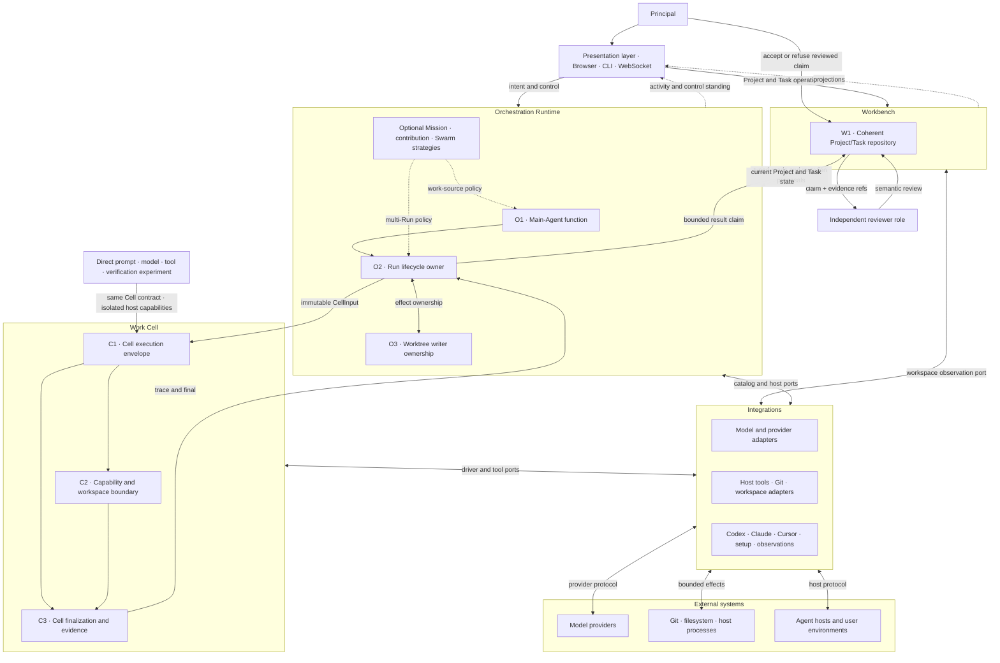

# Rossovia runtime module architecture — review record

**Status:** passed review record; Principal selected transition A

**Source baseline:** `ddd21d10acc2b5efc2d9aae082b9f09ac0de0072`

**Decision outcome:** the Principal accepted the runtime's modules, one core
Agent function, six enforceable mechanisms, their relations, and the staged
retention/retirement direction. The accepted source is
[Decision 055](../../decisions/055-rossovia-runtime-module-ownership.md); the
[migration plan](../rossovia-runtime-ownership-migration.md) sequences
implementation.

**Authority:** this record is supporting review evidence. It does not replace
[`design/DESIGN.md`](../../DESIGN.md) or Decision 055, retire a mechanism,
authorize a migration slice, or accept current product behavior.

**Selected surface:** transition A accepted the module ownership table, the
W1/O1/O2/O3/C1/C2/C3 set, the corrected cardinalities and effect boundaries,
and the retention/retirement direction. It did not accept current
implementation, authorize deletion, or authorize a big-bang rewrite. The wider
scan, current file map, framework comparisons, and migration questions remain
supporting evidence, not additional normative architecture.

## Principal orientation

### What Rossovia is

Rossovia is a workspace for turning a Principal's intent into attributable
Agent work without letting execution machinery redefine the Project, Task, or
acceptance decision. Its product loop is:

`understand the work → manage the Project and Task → authorize and supervise a run → execute one bounded Cell → retain evidence → review the result → let the Principal accept or refuse it`

The redesign is needed because the current implementation grew several
partially overlapping execution paths—ordinary Task runs, conversation
carriers, Mission runners, contributions, Swarm coordination, attempts,
settlements, controls, and recovery operations. Many are useful behaviors, but
their present physical grouping makes it hard to tell which facts are
authoritative, which lifecycle owns a failure, and which mechanisms are merely
strategies or adapters. The target does not remove the useful behaviors. It
gives each behavior one owner and refuses parallel sources of the same truth.

### The target system in one view

| Part | Plain-language job | Authoritative facts | Must not own |
|---|---|---|---|
| **Workbench** | Manage Projects and Tasks whether or not any Agent is running | Project identity and Worktree binding; Task objective, todos, corrections, lifecycle, claims, reviews, and Principal acceptance | Conversations, worker scheduling, model loops, run recovery, or UI state |
| **Orchestration Runtime** | Act as the Main Agent: understand intent, read current work, choose and supervise execution, and attribute results | Conversation intent; one Run lifecycle; live Run control; shared-Worktree writer ownership; optional Mission continuity and multi-run strategy | Project/Task meaning, Cell internals, provider protocol, or acceptance |
| **Work Cell** | Execute one bounded, immutable input through one model/tool driver and report what mechanically happened | Cell input, capability boundary, cancellation, trace/usage when available, mechanical checks, and at most one final | Project, Task, Mission, conversation, shared-Worktree authorization, semantic quality, or acceptance |
| **Integrations** | Translate Rossovia's ports to model providers, host tools, Git/workspaces, agent hosts, and launch environments | Adapter-local protocol behavior and normalized observations | Project, Task, Run, Cell, Mission, or acceptance truth |
| **Presentation** | Let a human or Agent see and control the system through CLI, browser, or WebSocket | Temporary interaction state and rebuildable projections only | Any fact that would disappear or change meaning when the UI is replaced |

These are logical ownership boundaries, not a demand for five packages or
services. The target should first simplify responsibility; physical movement
comes later and only where it improves that responsibility.

### One normal end-to-end path

1. The Principal or a client creates or corrects a Task in Workbench.
2. The Main-Agent function reads the current Project, Task, relevant Mission,
   and conversation context. It proposes what should run; Workbench does not
   launch work by itself.
3. The Orchestration Runtime creates one `Run` for the explicit execution
   request. The Run owns start, live control, terminal outcome, continuation
   lineage, and recovery meaning.
4. If the work may write a shared Worktree, the Run obtains exactly one writer
   ownership relation before effects. Read-only work does not pay this cost.
5. The Run lowers its request to zero or one immutable `CellInput`. A Run can
   fail before a Cell exists; one Run does not silently fan out into several
   Cells. Multi-worker behavior is a strategy that creates several explicit
   Runs.
6. Work Cell invokes one selected driver through declared capabilities.
   Integrations translate provider and host protocols but do not become the
   execution record.
7. Work Cell emits at most one final plus bounded evidence. The Run attributes
   that evidence to its Task and releases live ownership when it truthfully can.
8. Workbench retains a result claim. An independent reviewer judges semantic
   fitness; the Principal alone accepts or refuses the reviewed result.

A prompt/model/tool experiment may call Work Cell directly with the same Cell
contract. That path deliberately has no Task, Mission, Run recovery, or shared
Worktree authority. An effectful direct experiment must use a disposable or
otherwise exclusively owned workspace. This keeps Work Cell independently
useful for harness and prompt experiments instead of making Rossovia the only
way to run it.

### Failure and recovery in plain language

- If orchestration fails before creating a Cell, the Run fails with no invented
  Cell evidence.
- If a Cell process disappears without a trustworthy final, the Run becomes
  `unknown` or unresolved. Rossovia does not reconstruct success from partial
  traces, stale process observations, or model claims.
- If an effect may have committed but its acknowledgement is missing, the owner
  reconciles against the canonical effect receipt when one exists; it never
  blindly replays the effect.
- If shared-Worktree ownership cannot be released, the failure stays visible
  and blocks another writer until the exact owner recovery path resolves it.
- Semantic inadequacy is not an execution retry signal. It produces review
  evidence, a Task correction, an acceptance refusal, or a newly authorized
  Run. Mechanical observation, semantic review, and acceptance remain separate.

This design intentionally permits visible `unknown`. It gives up perfect
reconstruction of historical liveness, usage, and every interrupted state when
that precision would require another durable registry or guessed authority.
Exactness remains mandatory for destructive effects, concurrent writer
ownership, causal identity needed for safe reconciliation, and Principal
acceptance.

### What changes, what stays, and what disappears

| Current pressure | Target treatment |
|---|---|
| Several execution lifecycles expose their own start/control/settlement/recovery meanings | Consolidate the shared lifecycle into O2 `Run`; keep Mission, contribution, conversation, and Swarm behavior as work-source or scheduling strategies over Runs |
| Several paths protect or infer Worktree writing independently | One O3 writer-ownership mechanism, used only for effectful shared-Worktree Runs |
| Attempts, settlements, carrier handles, receipts, and projections can look like peer truth stores | Keep the minimum canonical Run/Cell/effect evidence; handles remain live process state, projections remain rebuildable, and copied evidence is removed or demoted |
| Provider, host, launcher, and agent-host behavior leaks into core ownership | Move protocol quirks and current product choices behind Integration ports; core tests use neutral identities |
| Harness actions multiply around retry, verify, review, continue, recover, and settle | Public execution semantics reduce to explicit `run` and exact live `stop`; review and acceptance return to Workbench, while reconciliation stays an idempotent owner-maintenance operation |
| Defensive precision keeps adding schemas and recovery paths | Retain precision only where wrong effects or authority would escape; report `unknown` elsewhere |

The hard constraints stay: Workbench Tasks remain the Principal-attributed work
and acceptance source; Work Cell remains standalone and provider-neutral;
shared effectful writing has one owner; effects are never automatically replayed
after ambiguous failure; semantic review is independent; ordinary execution has
no implicit step limit, though an explicit caller budget remains allowed.

### Decision outcome and authorized next step

The Principal selected **A — accept the target direction**. This accepted the
ownership, cardinality, and retention direction and authorized a formal
Architecture Decision plus a staged migration plan. It did not authorize a
big-bang package rewrite. Each migration slice must remove or demote one
duplicate owner while preserving the end-to-end path above.

The alternatives considered were:

| Choice | Immediate authorized result | Main tradeoff or reopening signal |
|---|---|---|
| **A — accept the target direction (recommended)** | Draft the formal Decision and sequence migrations by owner: Workbench purity, O2 Run, O3 writer ownership, Work Cell boundary, then Integrations/projections | Current duplicate mechanisms remain temporarily; each needs traced migration or retirement |
| **B — accept the modules but reopen one named relation** | Preserve the five-part split while revising the specified ownership/cardinality before a formal Decision | Useful if, for example, Run-to-Cell cardinality or Mission ownership is still wrong; name the exact relation rather than reopening the whole scan |
| **C — retain the current architecture for now** | Stop architectural migration and treat current mechanisms as implementation-specific systems | Avoids migration cost now, but preserves overlapping lifecycle/recovery owners and the present explanation burden |

Decision 055 now owns the accepted target. Source links and the remainder of
this record remain available for checking how the alternatives and boundaries
were derived.

## Why this view exists

Rossovia's current capability map mixes durable work sources, execution
mechanisms, provider adapters, safety controls, evidence, UI projections,
experiments, and compatibility code in one long list. That makes every item
appear equally architectural and makes local safety machinery look like an
independent subsystem.

This candidate first groups the system by responsibility. Each module then uses
the same internal layers, so one review can focus on a small number of related
mechanisms. The mechanism inventory is intentionally family-level: it includes
the current kinds of mechanism without freezing their schemas, filenames,
event names, lock algorithms, or command grammar.

The candidate is constrained by five existing boundary decisions:

- Workbench's local Task is the source for Principal-attributed obligation and
  acceptance; UI and execution adapters do not own that meaning
  ([Decision 053](../../decisions/053-principal-created-task-workbench.md#decision)).
- Work Cell owns one bounded execution and its mechanical evidence, not Task or
  Mission meaning ([Decision 007](../../decisions/007-independent-work-cell-runtime.md)).
- Mission Records preserve material cross-session return obligations and are
  not a task board, scheduler, or launch authority
  ([Mission boundaries](../../../operations/missions/README.md#boundaries)).
- Conversation storage owns delivery, order, causal references, and reconnect;
  it does not copy Task, Mission, effect, or acceptance truth
  ([System Case authority map](2026-08-13-conversation-command-entry-system-case.md#canonical-authority-and-state-map)).
- The current Workbench host-runtime launch carrier is the stable `rossovia` launcher
  executing tracked TypeScript source with Bun; a release package is not yet an
  accepted second carrier
  ([Decision 054](../../decisions/054-bun-source-workbench-runtime.md#decision)).

## Review method — identity, origin, and destination

This candidate is not derived from the current capability list. It applies the
[`mechanism-design-review`](../../../skills/mechanism-design-review/SKILL.md)
three-question method to each proposed module and mechanism:

| Question | Architecture meaning | Failure if omitted |
|---|---|---|
| **What am I?** | Form the object, unit, cardinality, owner, authority, and boundary before naming a module or mechanism | Files, commands, policies, evidence, projections, and state machines appear as equivalent architectural parts |
| **Where did I come from?** | Recover the observed pressure, accepted Decision lineage, current owner, operating conditions, and accumulated implementation history | Framework features and defensive code are mistaken for timeless requirements |
| **Where am I going?** | State the target relation, smallest transition, effect boundary, terminal/recovery owner, review path, and intentionally omitted precision | The design optimizes feature completeness rather than a simpler reliable system |

The method is generative rather than classificatory. It should let an Agent
derive the treatment of a new mechanism without memorizing Rossovia's present
list. The [worked cases](../../../skills/mechanism-design-review/references/cases.md)
show how the same questions produce different outcomes for admission gates,
artifact confirmation, action vocabulary, Task versioning, and Worktree writer
ownership. They are comparison evidence, not precedents with automatic force.

## Four logical modules and one presentation layer

The runtime has four logical modules. They are separated by what they own, not
by current package names or command paths. UI is a replaceable presentation
layer over those modules and is deliberately outside the logical partition.

| Module | Position in the system | Owns | Relation to the other modules |
|---|---|---|---|
| Workbench | Pure Project and Task management system | Project identity, Worktree binding, Task objective, todos, corrections, lifecycle, claims, semantic reviews, and Principal acceptance; external Worktree state remains a source-linked observation | Exposes typed reads and coherent mutations; mutable entities acted on asynchronously use an expected entity revision. It does not converse with models, schedule runs, execute tools, or own UI state. |
| Orchestration Runtime | Main-Agent control plane | Conversation and intent handling, current-context assembly, worker selection policy, Task/Mission-to-Cell lowering, explicit Run authorization where required, multi-Cell release and dependency policy, Run lifecycle, Worktree writer ownership through O3, control, continuation, recovery, result attribution, an activated Mission work-source record when cross-session return is required, and optional persistent or collective execution strategies | Reads current Workbench state, drives Work Cells through their public contract, and returns bounded result claims to Workbench. It never becomes the Project/Task source, performs the Cell's model loop, or accepts its own result. |
| Work Cell | Standalone provider-neutral bounded execution kernel | `CellInput` and driver contracts, caller-supplied tool-capability boundary, one driver invocation, cancellation, mechanical verification, minimum causal evidence, optional trace/usage, and at most one Cell final | Runs the same immutable input either for the Orchestration Runtime or directly for a prompt/model/tool/verification experiment. A direct effectful experiment is confined to a disposable or otherwise exclusively owned workspace. Work Cell does not require or read Workbench, Main-Agent, Mission, or conversation state. |
| Integrations | Replaceable external-system adapters | Model/provider adapters, host-tool and Git/workspace adapters, host-agent bindings, setup/status observations, runtime launch and host-carrier adapters, and quarantined compatibility adapters | Implements declared ports for Workbench, Orchestration Runtime, or Work Cell. It translates protocols and returns normalized observations but owns no Project, Task, Run, Run-handle, Cell, Mission, or acceptance fact. |
| Presentation layer (deferred) | Human and agent-facing views and controls | No logical facts; only interaction state and rebuildable projections | Browser, CLI, WebSocket, or another client invokes typed Workbench and Orchestration operations. Removing one UI must not change domain or execution truth. |

### Governing relations

Project and Task management is independent from execution:

`Principal or client → Workbench → Project/Task state`

Execution is initiated by the Main Agent rather than by Workbench itself:

`Principal intent → Orchestration Runtime → read current Workbench state → Work Cell → Integrations → external systems`

The same Work Cell remains directly usable without the product control plane,
but direct callers do not gain shared-Worktree authority merely by constructing
capability objects:

`Prompt/model/tool/verification experiment → isolated host capabilities → Work Cell → selected Integrations`

Evidence returns without transferring acceptance authority:

`Cell final → Orchestration Runtime attribution → Workbench result claim → independent review → Principal acceptance`

These paths are deliberately asymmetric. Workbench owns what the Project and
Task mean. Orchestration owns why, when, and how one or more Cells are run. Work
Cell owns what one bounded execution did and observed, regardless of which
caller formed its input. Integrations own only translation to external
protocols. The presentation layer owns none of these facts.

Mission continuity is an activated authoritative work-source record inside
Orchestration when cross-session return is required. A Mission runner,
contribution plan, and Swarm behavior are optional strategies that may consume
that fact; they are not the Mission fact and are not separate top-level
systems. When enabled, every concrete execution still uses the same Run owner
and Work Cell boundary; a Mission Record alone never grants launch or
acceptance authority.

## Whole-system view



Workbench, Orchestration Runtime, and Work Cell form the logical product core.
Integrations are required only where a selected external capability is used;
each concrete adapter remains replaceable. Dotted paths are projections or
optional orchestration strategies. UI may be designed later because its only
contract here is to invoke typed operations and display rebuildable views.
The direct experiment path is intentionally not a second runtime: it invokes
the same Work Cell contract without installing Workbench or Orchestration as a
precondition. Its writable host capabilities must be confined to a disposable
or otherwise exclusively owned workspace. A registered or shared Worktree may
receive writable capabilities only after Orchestration has obtained O3
ownership; this restriction belongs to the trusted host-capability factory,
not to a new lock inside Work Cell.

The reviewer node names a role, not a new runtime service. A human reviewer can
read the claim directly. When an Agent performs the review, Orchestration uses
the same `run(request)` path with read-only capabilities and reviewer purpose,
then proposes the resulting semantic assessment to W1. No separate review
queue, scheduler, or acceptance mechanism is introduced.

## Common layers inside every module

The module boundary answers *who owns the responsibility*. The layers answer
*what kind of thing a mechanism is*.

| Layer | Question | Examples | Architectural rule |
|---|---|---|---|
| Interface | How does another actor enter or observe the module? | management port, intent port, driver port, adapter port | An interface adapts; it does not become a new fact source. |
| Policy and judgment | Who chooses today's route, default, or semantic action? | coordinator judgment, worker selection, provider/model policy | Policy may change without changing the mechanism. |
| Control mechanism | What orders, bounds, excludes, interrupts, or recovers effects? | run owner, lease, cancellation, journal append, reconciliation | One control property should have one owner. |
| Authoritative record | Which semantic or causal facts must survive process and provider replacement? | Task, conversation receipt, Mission return condition | A durable fact has one canonical source. |
| Durable execution evidence | What immutable observation proves what one execution requested, did, and returned? | Cell final, terminal run commit, effect record | The producing runtime owns the record contract; the integrating owner may retain and attribute the exact record but must not create a competing final. |
| Projection and cache | What explains or displays sources and evidence without owning them? | activity, snapshot, work item, statusline, cache | If it can be rebuilt, it remains disposable. |

Concrete adapters belong to Integrations and implement a core module's declared
port. Experiments remain outside the logical runtime and exercise those same
ports. Neither receives fact authority merely because it has durable files.

## Mechanism discipline is guidance, not another gate

When a new or expanded mechanism proposal has unresolved necessity or
proportionality, use
[`mechanism-design-review`](../../../skills/mechanism-design-review/SKILL.md)
to compare it with the current owner and a smaller treatment. This is an Agent
judgment method, not a runtime admission system: it introduces no mechanism
registry, approval workflow, lifecycle state, required packet, CI gate, or
permanent checklist.

The review begins from an observed failure and its current owner. It prefers,
in order, keeping the design, clarifying a prompt/Skill/policy, repairing or
merging an existing mechanism, strengthening an existing deterministic
boundary, and only then proposing a new mechanism. A new mechanism remains
justified when software must preserve a property despite agent
misunderstanding, concurrency, bypass, or process loss—for example exact writer
exclusion or crash recovery—and no current owner already preserves it.

The method is available to every module but is not a standing preflight. It does
not freeze implementation forever: representative failure evidence may reopen
the design, but framework feature lists and hypothetical future needs do not
establish a new mechanism by themselves.

### Prefer sufficient truth over perfect reconstruction

The architecture does not require every observation to be exact, complete, or
recoverable forever. Perfect attribution often needs more copied identifiers,
cross-linked records, intermediate states, reconciliation branches, and tests;
those additions can make the normal path less reliable than an explicit
`unknown` or a small amount of lost diagnostic detail.

Use one proportionality judgment, not a new precision-budget mechanism:

1. What concrete harm follows from the less precise answer?
2. Is that harm visible, reversible, or recoverable through ordinary
   inspection?
3. How much state, branching, and recovery code disappears when precision is
   relaxed?

Retain exactness where a wrong answer can authorize disclosure, overwrite
another writer, repeat an irreversible effect, accept the wrong result, or
resume the wrong causal execution. Prefer simple and truthful incompleteness
for activity timing, diagnostics, cost estimates, projections, advisory model
metadata, and historical reconstruction that does not control effects. This is
an architecture tradeoff made by the existing owner, not a score, registry,
gate, or required review artifact.

## Target core function and mechanism set

A core mechanism must own one property that the normal product path cannot
reconstruct from another owner: a semantic fact, an external effect, a causal
decision, or a mechanical invariant. A schema, record type, adapter, policy,
projection, cache, CLI command, or file is not a separate mechanism merely
because it has its own implementation.

The target architecture has one core Agent function and six enforceable
mechanisms. This distinction matters: a contextual judgment should not acquire
its own durable state, recovery command, or admission lifecycle merely because
it is important.

| ID | Module | Function or mechanism | Unique job | Must not absorb |
|---|---|---|---|---|
| W1 | Workbench | Coherent Project/Task repository | Applies coherent Project, Worktree-binding, Task, claim, review, correction, and Principal-acceptance mutations; entity revisions reject decisions formed from stale domain meaning | Git truth, conversation, Run state, Cell evidence ownership, provider state, or UI state |
| O1 | Orchestration Runtime | **Agent function:** Main-Agent decision | Reads current intent plus exact Workbench and Run standing, then judges whether to emit a typed Workbench operation, a concrete Run request, or no action | Its own durable truth, direct model/tool execution, hidden provider policy, or self-acceptance |
| O2 | Orchestration Runtime | Run lifecycle owner | Binds one causal request to at most one immutable Cell invocation and one truthful Run outcome; owns preparation, start, supported live control, attribution, optional predecessor/continuation reference, terminal commit, and crash reconciliation, including a Run that ends before a Cell starts | Project/Task meaning, Cell-final rewriting, Worktree ownership standing, cross-Run scheduling policy, or acceptance |
| O3 | Orchestration Runtime | Worktree writer ownership | Atomically gives one effectful Run sole ownership of one exact Git Worktree and preserves enough owner identity to release or reconcile the claim after failure | A generic resource-lock service, Task lifecycle, scheduling, retry policy, provider sessions, or semantic success |
| C1 | Work Cell | Cell execution envelope | Validates one immutable `CellInput`, invokes one supplied driver under caller cancellation and explicit emergency bounds, and, when execution reaches finalization, hands the observed outcome at most once to C3 | Worker selection, budget approval, Run retry/continuation, multi-Cell scheduling, or durable conversation state |
| C2 | Work Cell | Capability and workspace boundary | Projects caller-granted, enforceable host capabilities and workspace policy into the only effects available to the driver | Self-declared capability strings as authority, cross-Run writer exclusion, Project registration, provider choice, or result acceptance |
| C3 | Work Cell | Cell finalization and evidence | Independently checks only caller-declared mechanical conditions against observed effects and, when finalization completes, emits at most one immutable `CellFinal`; a hard process loss may truthfully leave no final | Semantic fitness, durable crash recovery, provider-specific settlement loops, Run standing, Task result claims, Principal acceptance, or adapter-native session authority |

### Precision retained and intentionally relaxed

| Owner | Precision worth retaining | Precision to relax for simplicity and reliability |
|---|---|---|
| W1 | Current Task identity, lifecycle, accepted result, and stale semantic mutation rejection | A perfect cross-record snapshot, global repository generation exposed to every caller, and exact freshness of rebuildable projections |
| O1 | No extra precision mechanism; judgment reads the current named owners before a consequential action | Persisted copies of assembled context, rationale, catalog state, or every intermediate coordinator belief |
| O2 | One request-to-Cell causal identity, explicit terminal standing, and safe continuation/retry identity | Perfect reconstruction of every transient activity event, provider-native step, carrier transition, or historical session detail |
| O3 | At most one effectful writer for one Worktree and safe refusal to release another owner's claim | Generic resource leasing, heartbeat/TTL, perfect liveness inference, and rich owner metadata when a process-scoped lock plus bounded cleanup can prove sufficient |
| C1 | The input fields that change executable behavior, cancellation, workspace, or declared limits | Freezing derived defaults, advisory metadata, and provider details that the driver can truthfully report as unknown |
| C2 | Workspace containment and capabilities whose violation can escape or corrupt the host | A fine-grained declarative capability ontology when a few enforceable host ports or sandbox classes provide the same containment |
| C3 | Terminal status, observed effects needed for mechanical judgment, and evidence cited by a result claim | Exact raw-step counts, copied input equality, fingerprints, token/cost completeness, and exhaustive artifacts when absence can remain explicit |

This table reopens the implementation shape, not the safety properties. In
particular, O3 may become a simpler process-scoped writer lock only if a focused
probe proves that no child effect can outlive its owner; otherwise a minimal
durable owner identity remains necessary. C3 should be truthful rather than
omniscient: `unknown` is a valid evidence value, while an invented exact value
is not.

### Harness evidence, review, acceptance, and minimal action semantics

The harness must not use one word such as `verified`, `passed`, `failed`, or
`retry` for multiple authorities. The same separation applies to code,
documents, images, research, plans, migrations, and generated artifacts.

| Meaning | Owner | What it may establish | What it must not establish |
|---|---|---|---|
| Mechanical observation | C3 or a selected deterministic checker | Required path exists, bytes are readable, declared format/schema parses, referenced object exists, command/test has the encoded outcome, observed workspace effect matches a declared mechanical condition | Usefulness, design quality, whether prose or code solves the objective, or acceptance |
| Producer result claim | Orchestration attributes C3 evidence; Workbench retains the claim | The producer says this exact evidence supports completion of the Task | That the producer's interpretation is correct |
| Semantic review | Independent reviewer, separate from the producer | Fitness to objective, quality, relevance, design conformance, important omissions, and a recommendation | Principal acceptance or permission to repeat effects |
| Acceptance | Principal through W1 | The reviewed claim becomes the accepted Task result | Execution truth, provider truth, or future correctness |
| Next-action decision | O1 under current authority and policy | Read current facts, request one new Run, stop one supported live Run, or propose one typed W1 mutation | Turning an observation, reason, lifecycle repair, or domain transition into another runtime action |

An artifact check therefore confirms only the declared artifact contract. For
code it may confirm that files exist, parse, typecheck, and pass tests whose
assertions encode a mechanical contract. It cannot conclude that the output is
the right design, solves the user need, or is ready for acceptance. Those are
review judgments. Review should be independent of the producer; it is evidence
for the Principal, not a second acceptance authority and not a mandatory global
queue for every trivial observation.

The earlier flat action table is rejected because first-time verification,
format-only repair, terminal commit after recovery, and review follow-up do not
map to single peer verbs. It also contradicted itself by treating continuation
as both the same execution and a successor Run. The target therefore does not
keep that vocabulary.

The public Orchestration execution surface needs only:

| Operation | Relation | Meaning |
|---|---|---|
| `run(request)` | Creates one new O2 Run and, after preparation succeeds, at most one Cell invocation | The request carries current input, purpose, capabilities, and optional predecessor/adapter-continuation reference; authorization, ownership, or preparation refusal may terminalize the Run before a Cell starts |
| `stop(runId)` | Controls one exact live O2 Run | The only baseline live control; another control must be justified by a real owner capability and failure |

These are the Agent-facing execution effects, not the entirety of O2's owner
interface. O2 also needs read-only standing inspection and an idempotent
owner-maintenance reconciliation entry that a host or operator can invoke after
process loss. Reconciliation may validate and complete an existing Run outcome
or release the still-matching O3 owner; it may not start a Cell, replay an
external effect, mutate Task meaning, or become another O1 action verb. Its
representation—automatic startup repair, an operator command, or an internal
service call—belongs to the owning runtime review, but the callable recovery
property may not be omitted.

Everything else is classified by its owner rather than promoted to a Harness
action:

- reading, artifact checking, non-mutating deterministic tests, and repeated
  checking are observations; repetition does not create `reverify` as a new
  action type;
- a checker that may mutate source, workspace, a database, or an external
  system is an ordinary `run(request)` regardless of whether it is named test,
  verify, review, or inspect;
- an Agent semantic review is an ordinary read-only Run with reviewer purpose,
  while a human review needs no runtime action;
- a changed objective or constraint is a W1 correction; a later execution is
  simply another `run(request)` with the new input;
- acceptance and result-claim submission are typed W1 mutations;
- terminal commit, ownership cleanup, and evidence reconciliation are O2/O3
  state-owner work, not Agent-facing actions;
- a provider/transport retry is private Integration policy and is permitted
  only before an effect committed or with proven idempotency; and
- “continue” and “rerun” describe why a new RunRequest references a predecessor
  or reuses adapter state. They are lineage and policy, not additional verbs.

A semantic review that says “not good enough” does not authorize another Run.
It may support a W1 correction proposal or acceptance refusal; O1 separately
decides whether to request new execution under current authority. A schema
failure may justify a bounded adapter format repair when no external effect is
repeated, but that repair remains inside the adapter. Reconciliation never
becomes replay, and reconnect is only transport behavior.

This compression follows the present owners rather than the present file
count: Workbench already holds revisioned Task meaning in
[`contracts.ts`](../../../operations/workbench/src/contracts.ts) and
[`tasks.ts`](../../../operations/workbench/src/tasks.ts); ordinary execution,
attempt evidence, and the current Worktree lease meet in
[`task-run.ts`](../../../operations/workbench/src/task-run.ts); conversational
execution duplicates part of that lifecycle in
[`execution-carrier.ts`](../../../operations/workbench/src/conversation/execution-carrier.ts);
and the standalone Cell envelope and host-effect boundary live in
[`run-cell.ts`](../../../packages/work-cell/src/run-cell.ts) and
[`host-tools.ts`](../../../packages/work-cell/src/host-tools.ts). Those files
are evidence for the ownership problem, not a proposed final package layout.

This table is an architecture statement, not a mechanism registry. It creates
no admission service, required review artifact, CI gate, or runtime lookup.
When a proposed feature does not fit one of these owners, first test whether it
is a record, policy, adapter, projection, or optional strategy. Only an observed
new mechanical invariant can reopen the core set.

### Supporting forms are not additional core mechanisms

| Current form | Target classification | Owner and direction |
|---|---|---|
| Project registry, Worktree binding, Task lifecycle, claims, reviews, corrections, and Task todos | Domain records and transitions inside W1 | Keep their meanings; consolidate mutation and revision handling instead of giving each record its own control path |
| Conversation journal and reconnect cursor | Activated causal-ingress support for O1/O2 | Keep when interaction must survive disconnect or process replacement; a synchronous direct entry need not install it |
| Context assembly, worker catalog, model route, tools, budgets, and verification selection | Rebuildable projection and policy for O1 | Read current sources at decision time; do not persist another context truth |
| Run authorization | An explicit attribute of an O2 Run request when disclosure or launch needs Principal authority | Do not create a parallel Task lifecycle or general approval system |
| Attempt, input, control, final reference, settlement, continuation, and activity | Phases, evidence, and projections of O2 plus the immutable C3 final | Consolidate around one Run identity rather than retaining one lifecycle owner per file or feature |
| Mission Record | Activated authoritative work-source record inside Orchestration | Retain only for material cross-session return obligations; one canonical Mission mutation owner governs focus, branch standing, settlement, and retirement, while every concrete execution still lowers through O2 |
| Mission runner, contribution, dependency graph, and Swarm | Optional persistent or multi-Run strategies above O1/O2 | Activate only for work that ordinary Tasks and sequential Runs cannot express; consume rather than duplicate Mission or Task facts and reuse O2/O3 for every child execution |
| Cell tasks or plan items | Optional execution-local coordination inside C1 | Never compete with Workbench Task todos; discard or retain only as Cell evidence |
| Provider-native todos or sessions | Adapter-local observation | May help a driver resume its protocol, but never become Task, Run, or Cell-final authority |
| Artifact requirements and artifact observations | Inputs to C3 mechanical verification and evidence cited by a Workbench result claim | Do not add a global artifact registry unless a later domain requirement establishes a unique owner |
| Hooks, statusline, snapshots, work items, and activity feeds | Integration or presentation behavior | Keep them rebuildable, optional, and unable to create semantic facts |

### Wider mechanism scan

The scan found no seventh enforceable daily-core mechanism. The former seventh
item, O1, is a judgment function. It also found several real but activated
mechanisms, several implementation details that should remain inside an owner,
and several duplicate lifecycles that should be consolidated.

| Current design family | Target form | Direction |
|---|---|---|
| [Conversation journal](../../../operations/workbench/src/conversation/journal.ts), message identity, action receipt, and reconnect cursor | Activated durable-ingress mechanism for O1/O2 | Keep only for interaction that must survive reconnect or process replacement; do not require it for direct Runs |
| [Prompt composition](../../../operations/autonomy/src/conversation-prompt.ts), [context assembly](../../../operations/workbench/src/conversation/context.ts), worker selection, model/tool/budget choice | O1 judgment, projection, and policy | Keep replaceable and mostly rebuildable; do not add a decision-state machine |
| [Execution authorization](../../../operations/workbench/src/execution-authorization.ts) receipt and consumption | Activated grant mechanism referenced by O2 | Retain one canonical grant and one-use consumption when a Run actually requires prior authority; do not copy its fields into parallel receipts |
| [Attempt, input, final, settlement, and recovery](../../../operations/workbench/src/task-attempts.ts) plus control, continuation, and carrier | O2 Run phases, evidence, and live-handle projection | Consolidate around one Run identity; a carrier is not a second durable lifecycle |
| Mission input, anchor, and continuity | Activated long-horizon authoritative work-source facts inside Orchestration | Keep one canonical writer, explicit settlement, and a deletion/archival path after the return obligation is discharged; lower each concrete execution through O2 |
| [Contribution](../../../operations/workbench/src/conversation/contributions.ts) spawn reservation, liveness, control, terminal state, and lease recovery | Duplicate Run lifecycle around an optional strategy | Retain contribution intent, dependency key, synthesis relation, and result reference; replace its execution lifecycle with O2 |
| [Swarm and queue](../../../packages/work-cell/src/orchestration.ts), graph, and delegate batches | Scheduling policy plus aggregate projection over many O2 Runs | Move from the Cell kernel to Orchestration; no aggregate `*Run` may be confused with the one-Cell O2 Run |
| Cell [`TaskStore`](../../../packages/work-cell/src/task-store.ts), native todos, and plan items | Optional execution-local checklist/evidence | Default to absent; remove ownership/dependency semantics that duplicate Workbench Tasks or orchestration graphs unless a concrete experiment needs them |
| Terminal tools | Caller-selected C3 submission interface | Keep the one-of mechanical check; do not make each terminal form a mechanism |
| [Structured-settlement retry loop](../../../packages/work-cell/src/structured-settlement.ts) | Provider/SDK compatibility adapter | Enable only for a selected adapter that cannot return the declared shape directly; it is not C3 itself |
| Output schema and artifact requirements | C3 verification inputs | Keep neutral validation and effect observation; no global artifact system or schema authority |
| Budget estimate, explicit limits, extension request, and approval | O1/O2 policy plus C1 enforcement | Keep no implicit step limit; move extension judgment out of the Cell while C1 enforces the accepted envelope |
| [Model route](../../../packages/work-cell/src/model-route.ts) and availability fallback | Integration mechanism under explicit O1 policy | Keep provider error semantics and no-replay boundary inside adapters; do not let routing restart a Cell or become Run truth |
| [Worker catalog](../../../packages/work-cell/src/worker-catalog.ts), [provider profile](../../../packages/work-cell/src/provider-profile.ts), quota observer, pricing, and fingerprints | O1 policy plus Integration observation | Keep selected facts source-linked and replaceable; they are not Cell-core state |
| Trace, raw steps, activity, summaries, indexes, and status | C3/O2 evidence plus rebuildable projections | Keep the minimum causal ledger; make raw provider diagnostics opt-in and never a second final |
| [Hooks](../../../operations/workbench/src/hooks.ts), setup, migration, launcher, statusline, and host payload normalization | Integrations | Keep only bindings with a current host consumer; they create no Workbench or Run truth |
| [Snapshot and work-item](../../../operations/workbench/src/ui/projection.ts) feed/browser state | Presentation | Rebuild from named owners and delete duplicate liveness/semantic state |
| Cognition, deliberation, evaluation, activation, and probes | Labs or domain adapters | Keep outside normal startup and public core exports until a separately accepted product role exists |

The word *mechanism* still applies to an activated journal, grant, or provider
route when it owns a real mechanical property. “Six” counts only the mechanisms
required in the ordinary successful Project → Task → Run → Cell path; it is not a registry
that bans every optional mechanism.

### Relations and cardinality

The target relation is deliberately small:

```text
Project 1 ── * Task
Task    1 ── * Run
Run     1 ── 0..1 CellInvocation
Direct experiment 1 ── 1 CellInvocation
CellInvocation 1 ── 0..1 CellFinal
Task    1 ── * result claim
result claim 1 ── * semantic review
result claim 1 ── 0..1 Principal acceptance
```

Every Orchestration-owned Cell invocation belongs to one new Run and never
reopens or rewrites a prior Run or Cell final. A Run exists before its Cell:
authorization refusal, Worktree-ownership refusal, stale revalidation, or
preparation failure may therefore leave a terminal Run with no Cell invocation.
Once a Cell starts, that Run cannot start a second one. A RunRequest may cite a
predecessor and an adapter-supported continuation reference; that relation
explains “continue” without adding another runtime action. A multi-Cell plan is
a set of Runs with orchestration-owned dependency policy, not a larger Cell.

A direct experiment calls C1–C3 without creating a Project, Task, or Run. It
still creates one CellInvocation identity, but receives no O2 crash-recovery or
shared-Worktree ownership. C3 emits no more than one immutable CellFinal. Normal
completion produces one; a hard host or process loss may produce none. O2 may
record a terminal `no-final` Run outcome only after the Cell is proven
quiescent; otherwise the outcome remains unresolved. Neither O2 nor a direct
caller may synthesize a replacement CellFinal.

```mermaid
sequenceDiagram
    actor P as Principal / client
    participant W as W1 · Project/Task repository
    participant D as O1 · Main-Agent function
    participant R as O2 · Run owner
    participant L as O3 · Worktree writer ownership
    participant C as C1–C3 · Work Cell
    participant I as Integrations
    participant V as Independent reviewer

    P->>D: intent or explicit work request
    D->>W: read exact Project/Task revision
    W-->>D: current domain snapshot
    D->>R: typed RunRequest; create one Run identity
    opt effectful Run
      R->>L: claim exact Worktree writer ownership
      L-->>R: exclusive ownership or refusal
    end
    alt preparation succeeds
      R->>C: persist immutable CellInput and run at most one Cell
      C->>I: model and bounded host calls
      I-->>C: normalized results and errors
      C-->>R: trace + CellFinal when finalization completes
    else refused or failed before Cell start
      R->>R: retain truthful no-Cell outcome
    end
    R->>R: commit O2 outcome when Cell quiescence is known
    opt effectful Run
      R->>L: release or reconcile exact ownership
    end
    R-->>D: Run outcome + separate ownership standing
    opt claim-worthy evidence exists
      D->>W: bounded result claim
      W-->>V: exact claim + evidence references
      V->>W: semantic review
      W-->>P: current claim + review standing
      P->>W: accept, refuse, or correct through typed W1 mutation
    end
```

Failure follows the same ownership rather than adding another recovery system:

| Failure | Owning response |
|---|---|
| Stale Project/Task context | W1 rejects the mutation before an effect is authorized |
| Concurrent effectful Worktree writer | O3 refuses the second exact Worktree owner |
| Cell, model, tool, or adapter failure | C3 emits a truthful final when finalization completes; if no final exists, O2 records `no-final` only after proving quiescence and otherwise remains unresolved |
| Orchestration process loss | O2 reconstructs the Run from its request plus any exact C3 evidence without inventing a Cell or final; O3 independently retains or reconciles the exact Worktree owner |
| UI or socket disconnect | Rebuild from optional causal ingress plus W1/O2 sources; never infer execution or Task truth from client memory |
| Semantic result is wrong despite a successful Cell | Workbench claim review and Principal acceptance remain open; no runtime mechanism converts mechanical success into acceptance |

## Module — Workbench

### Responsibility

Workbench is a pure Project and Task management system. It owns what Projects
exist, which Worktrees are bound to them, what a Task asks for, and how that
Task moves from creation through correction, result review, and Principal
acceptance. Current branch, HEAD, dirty state, and filesystem contents remain
source-linked observations returned by an Integration; Workbench may retain a
freshness-bearing projection but does not turn it into a second Git fact. It
offers typed reads and coherent mutations to humans and the Orchestration
Runtime, with entity revisions where a caller can act from a stale snapshot.

Workbench does not own conversation, a Main Agent, worker selection, Run state,
model execution, Mission supervision, provider protocols, or presentation.

### Core mechanism and supporting surfaces

Workbench has one core mechanism: **W1, the coherent Project/Task
repository**. Workbench Home is its relocatable storage boundary; Project,
Worktree binding, Task, todos, corrections, claims, reviews, and acceptance are
records and transitions inside it rather than separate mechanisms.

The Project/Task management port is W1's interface. Git/workspace observation
and Project/Task views are rebuildable projections. User preferences and
domain defaults are policy. A future physical transaction or lock may implement
W1's coherent-mutation property, but it does not create a second domain owner.

### Why versioning exists — and where it should stop

Versioning is justified only where a decision can outlive the state it read.
The representative failure is not simultaneous file writing; it is a
long-running Agent reading Task revision 7, a Principal correcting the Task to
revision 8, and the Agent later submitting or reassigning work as though
revision 7 were still current. Serializing those writes does not fix the
semantic error: the stale operation can wait its turn and still overwrite the
newer meaning. An expected Task revision makes the outdated premise visible
and forces the caller to re-read before deciding again.

Three different things currently risk being called “versioning”:

| Kind | Benefit | Target treatment |
|---|---|---|
| Entity revision, such as `task.revision` | Rejects a mutation whose semantic decision was formed from an older Task | Keep for mutable entities acted on asynchronously |
| Repository generation, such as the current Task `sourceRevision` | Detects an aggregate snapshot that changed; prevents lost updates only when check and commit share one serialized or atomic W1 transaction | Keep as an internal transaction generation while that storage shape exists; do not make every caller carry it when W1 can serialize and commit writes itself |
| External source version, such as Git HEAD | Identifies the observed Worktree source used to form or run work | Keep as a freshness-bearing Integration observation, never a Workbench domain revision |

The benefit is therefore **stale-decision rejection**, not history for its own
sake. W1 does not need event sourcing, per-field versions, or a globally visible
revision on every record. Project records need an entity revision only when
they become mutable objects that independent actors can update from stale
snapshots; immutable registration plus one coherent W1 transaction is enough
until then.

The current requirement for both `expected-source-revision` and
`expected-revision` on ordinary Task mutations exposes the physical aggregate
to every Agent and causes unrelated Task updates to conflict. The target is one
caller-facing Task revision and an internal repository commit generation. A
storage implementation with unavoidable direct multi-process writers may keep
the generation check internally, but it is not a second semantic mechanism.

The current implementation reads `tasks.json`, checks `sourceRevision`, and
later atomically renames a replacement file
([`tasks.ts`](../../../operations/workbench/src/tasks.ts),
[`home.ts`](../../../operations/workbench/src/home.ts)). Two processes can both
read generation N before either rename, both pass the check, and both write
generation N+1; atomic rename prevents a torn file but not the lost update.
Therefore the present generation is a useful stale-snapshot precondition, not
yet a cross-process CAS. W1 still needs one serialized writer or an actual
check-and-commit transaction if concurrent Home mutation is supported.

### Focused review questions

1. Can every Project and Task operation be explained without conversation,
   Mission, Run, worker, hook, or UI concepts?
2. Can registration and Task updates share one coherent Home mutation boundary?
3. Does every result claim retain evidence references without importing Run or
   Cell lifecycle into Task truth?
4. Which current Workbench files are actually orchestration or presentation
   concerns and should move behind a port?

## Module — Orchestration Runtime

### Responsibility

The Orchestration Runtime is the Main-Agent control plane. It receives intent,
reads the current Project and Task state from Workbench, assembles context,
selects a worker and policy, forms one or more concrete `CellInput` values,
drives Work Cells, attributes their evidence, and proposes result claims or
Task mutations back to Workbench.

It also owns every Run-level control property: one live owner, stop,
continuation, terminal commit, and crash recovery. For an effectful Run, O2
obtains exclusive Worktree-writer ownership from O3; O2 does not independently
implement that exclusion.
Where disclosure, scope, budget, or one launch requires explicit Principal
authorization, the Runtime owns validation and retention of that Run grant as a
control fact distinct from Task meaning and later acceptance.
An activated Mission Record is Orchestration's authoritative work-source fact
for a material cross-session return obligation. Its canonical mutation port
owns current focus, branch standing, settlement, and retirement after the
obligation is discharged. Mission runner behavior, contributions, and Swarm
are optional strategies inside this runtime; they consume rather than replace
Mission or Task facts and are not independent execution stacks. The runtime does not own
Project/Task truth, Cell execution truth, provider protocols, or acceptance.
It also does not implement the model/tool loop hidden behind a Work Cell
driver. Replacing AI SDK, Pi, or another conforming execution adapter must not
change Task meaning, Run authority, or recovery semantics.

### Core function, mechanisms, and supporting surfaces

The Orchestration Runtime has one core Agent function and two enforceable
mechanisms:

- **O1, the Main-Agent decision function:** observe current sources, judge, and
  emit a typed domain operation or Run request. Its implementation may be a
  prompt, Skill, model/tool loop, or later substitute; it earns no separate
  durable state merely for making the judgment.
- **O2, the Run lifecycle owner:** own one request-to-terminal execution and its
  causal control, evidence attribution, optional continuation relation, and
  recovery.
- **O3, Worktree writer ownership:** exclude and recover one exact effectful
  Worktree owner across Runs.

Intent/control ports and result handoff are interfaces. Context assembly and
activity are projections. Worker, provider, tool, budget, verification, and
dependency choices are policy. Conversation durability and explicit Run grants
are activated control forms. A Mission Record is an activated authoritative
work-source record. Mission runner, contribution, and Swarm are strategies;
none creates a second Run lifecycle or a second O3 owner. Ordinary Task work
does not install any of them.

O1 becomes a mechanism candidate only if practice establishes a control
property that prompt/Skill judgment plus the existing O2 owner cannot preserve.
For example, a durable conversation journal may be required to receipt user
input across disconnects, but that journal is an activated ingress mechanism;
it does not turn the Main Agent's contextual judgment into a new source of
truth.

O2 execution outcome and O3 writer ownership are two orthogonal facts. O2 may
commit a terminal outcome when preparation ends before Cell start, when a C3
final has been attributed, or when an absent final and Cell quiescence are both
proved. O3 separately remains `held`, `released`, or `reconcile-required` in
the owning implementation. If the Cell is quiescent but O3 cleanup cannot be
confirmed, the Run outcome remains terminal with a visible `cleanup-required`
projection while O3 continues to block another writer. This is simpler than
making release failure a second non-terminal Run state and remains safe because
O3, not the Run label, controls writer admission. A result claim may cite the
terminal outcome when its required evidence exists; cleanup failure adds no
semantic success. If Cell quiescence itself is unknown, O2 reports the outcome
as unresolved rather than inventing terminality or a Cell final.

Terminology should converge as the records consolidate:

- **Run** is the O2 identity for one causal execution request and at most one
  Cell invocation;
- **attempt** is the current name for that Run and should not remain a parallel
  concept;
- **RunHandle** is O2's live process-local handle for one Run; it carries
  control attachment and normalized liveness/quiescence observations but no
  durable truth;
- **host carrier or launcher adapter** is an Integration that starts or observes
  a concrete host process and reports normalized facts to O2; it does not own
  the RunHandle's meaning;
- **Mission turn**, **delegate batch**, and **Swarm batch** are aggregate
  strategy projections over zero or more Runs, never Runs themselves.

### What O3 actually is

O3 is not a scheduler, Task lock, retry queue, authorization grant, generic
resource-lock service, or distributed lock framework. It solves one observed
mechanical problem: two independent Runs can both be validly authorized yet
must not concurrently mutate the same Git Worktree. A prompt cannot preserve
that invariant across processes or after one owner crashes, and Git's short
command-level locks cannot prevent two long model/tool loops from interleaving
effects between commands.

The target property is **exclusive Worktree-writer ownership**. Select its
simplest adequate implementation only after proving whether a child effect can
outlive the process-scoped owner:

- when the execution boundary guarantees quiescence before owner exit, use a
  process-scoped lock that the host releases automatically; or
- when a writer can survive or become detached, retain a minimal durable owner
  claim and explicit recovery.

The heavier durable form is:

```text
prepare immutable Run request and canonical Worktree identity
  → atomically create owner claim or refuse
  → revalidate Task, binding, source, and resource after ownership
  → execute at most one Cell or retain a pre-Cell refusal/failure
  → retain the exact Cell outcome, or truthful absence, without synthesis
  → commit O2 outcome when Cell quiescence is known
  → release the still-matching owner claim
  → expose O3 cleanup standing independently

owner disappears before release
  → retain the claim and available Run evidence
  → prove the recorded owner is absent
  → require exact Run/resource/claim identity
  → release or report uninspectable; never infer success
```

The durable claim, when it is actually needed, needs only the canonical
Worktree identity, Run identity, owner identity, and the exact bytes or digest
required to prevent one owner from releasing another owner's claim. Read-only
Runs do not acquire it. Revalidation after acquisition closes the race between
reading Workbench/Git state and becoming the exclusive writer. A retained claim
blocks another writer, but does not require rewriting an already-known Cell
outcome as non-terminal.

The current `rossovia-task-run.lock` already implements much of this shape:
atomic `wx` creation in the exact Git metadata directory, Task/attempt/PID
identity, byte-matched release, and fail-closed dead-owner reconciliation in
[`task-run.ts`](../../../operations/workbench/src/task-run.ts). It has no expiry,
renewal, or time-bounded ownership. In distributed-systems terminology that is
closer to an **owner-identified exclusive lock** than a lease. The target name
therefore describes the invariant rather than preserving the historical
filename.

W1 repository transactions and the optional conversation journal may still
need private write serialization, but those are internal consistency details of
their own owners, not O3 claims. O3 also does not automatically extend to a
deployment target, API, database, or other remote effect. Those integrations
first use their native transaction and idempotency semantics; only a separate
observed exclusion failure could justify extending or adding an ownership
mechanism.

A future TTL or heartbeat lease would be a different and heavier mechanism. It
would be justified only if owners can become unreachable without a reliable
death signal and the system must recover automatically within a bounded time.
Nothing in the current local Worktree case establishes that requirement;
automatic expiry could instead admit a second writer while the first is merely
slow. O3 should therefore have no time-based auto-release. Explicit fail-closed
reconciliation belongs only to the durable-claim form; a proven process-scoped
lock should not add a durable recovery protocol merely to preserve richer
history.

### Focused review questions

1. Can task-run, execution carrier, contribution carrier, Mission runner, and
   Swarm share one Run lifecycle owner?
2. Does the Main Agent need every projected context field, or can it read most
   state on demand through Workbench and Integration ports?
3. Can request, attempt, final, settlement, control, continuation, and activity
   become one compact Run evidence family without losing crash truth?
4. Which persistent and collective strategies have representative work that an
   ordinary Task plus sequential Cells cannot express?
5. Can recovery become a normal runtime operation instead of a specialist CLI?

## Module — Work Cell

### Responsibility

Work Cell executes one already-formed, immutable unit of work. It owns the
provider-neutral input and driver contracts, allowed tool surface, workspace
containment, cancellation, emergency duration, mechanical verification,
minimum causal evidence, and an at-most-once finalization contract. Normal
finalization emits one immutable final; hard process or host loss may leave no
final. Usage and rich traces are retained when the selected adapter can report
them truthfully; they are not required to manufacture completeness.

It is a standalone kernel, not an embedded private implementation detail of the
Orchestration Runtime. A target test or experiment can construct `CellInput`,
supply a driver and bounded host capabilities, run the Cell through an injected
test host or a disposable/exclusively owned workspace, and inspect the same final without creating a Project, Task,
conversation, Mission, Run journal, or UI session. Deterministic fake drivers
remain first-class so prompt construction, tool behavior, provider adapters,
mechanical verification, and terminal evidence can be tested independently.
Direct execution against a shared or registered Worktree is not this path: the
trusted host may create writable capabilities for that Worktree only after an
Orchestration Run holds O3 ownership.

It does not read Workbench directly, choose why a Task should run, coordinate
other Cells, claim cross-Run Worktree writer ownership, retry or continue a prior Run, own
external protocols, mutate Task or Mission state, or accept its own result. A
Cell may have many model/tool steps, but it still has one caller, one immutable
input, one cancellation owner, and at most one final.

### Core mechanisms and supporting surfaces

Work Cell has three core mechanisms:

- **C1, the execution envelope:** one immutable input, one supplied driver, one
  cancellation owner, and at most one handoff to finalization.
- **C2, the capability and workspace boundary:** the only enforceable route
  from a driver to bounded host effects.
- **C3, finalization and evidence:** when reached, one truthful final built from
  the terminal outcome, caller-required checks, and the observed effects needed
  to support that outcome independently of the driver's own success claim. It
  never fabricates a final after its own process boundary is lost.

The direct Cell entry, `CellInput`, driver, host-capability port, and observation
callbacks are interfaces. Caller-selected budgets and verification
requirements are policy; Work Cell enforces only the explicit bounds and
checks it receives, including no implicit default step limit. Budget extension
or approval belongs to Orchestration; C1 only enforces the accepted envelope.
Cell-local checklists, structured output help, raw steps, and detailed
diagnostics are optional supporting forms rather than additional core
mechanisms. When no checklist policy is selected, no task-mutation tools should
appear by default.

C3 remains distinct from C1 because it controls a different failure. C1 can
successfully receive a driver return while the driver omitted a required
terminal action, returned schema-invalid output, named an artifact that does
not exist, or left an activated checklist unsettled. C3 checks only the
caller-declared requirements and effects that can change the mechanical
outcome before at most one immutable final is formed. Missing optional usage,
fingerprints, raw steps, or unrelated artifacts remain explicitly absent; C3
does not fail or add reconciliation merely to reconstruct them. Combining C1
and C3 in one package may be harmless, but the driver must not certify its own
mechanical result.

The minimum driver conformance profile should require only one invocation,
cancellation observation, normalized usage/trace, and a result C3 can check.
Terminal-tool selection, native structured output, resumable provider sessions,
images, reasoning streams, and provider-specific task projections are declared
adapter capabilities. One unsupported optional feature must not make the whole
Cell contract provider-specific.

### Boundary with the Orchestration Runtime

The easiest way to confuse these modules is to call both of them a runtime.
Their units and clocks are different:

| Question | Orchestration Runtime owns | Work Cell owns |
|---|---|---|
| What should be done? | Current Principal intent plus exact Project, Task, and optional Mission meaning | Nothing; receives already-formed instructions and context |
| Who/what should execute? | Worker, provider route, tool set, budget, verification, and adapter policy | Validates and uses the supplied driver and capabilities |
| What is the unit? | A Run and, optionally, a dependency graph or sequence of Runs | One Cell with zero or more model/tool steps and at most one final |
| What may run concurrently? | Scheduling, dependency release, and exact Worktree writer ownership across Runs | Nothing across Cells; contains effects inside this Cell's declared workspace/capabilities |
| What survives interruption? | Run request, authorization, attribution, control, continuation lineage, terminal commit, and recovery standing | Whatever truthful trace, usage, verification, workspace effects, and final were emitted before the Cell process boundary was lost; no recovery promise on its own |
| Who repeats or continues work? | Orchestration creates a new RunRequest with an optional predecessor/adapter-continuation reference | Never chooses lineage or repeats a previous execution on its own |
| Who decides success? | Attributes Cell evidence and proposes a claim; Workbench and Principal retain semantic acceptance | Reports mechanical execution and verification only |
| Can it run alone? | Only with an intent/work-source caller and its required state owners | Yes; direct experiments use the same Cell contract |

The boundary contract is therefore conceptually:

```text
runCell(immutable CellInput, CellDriver, HostCapabilities, AbortSignal?)
  -> trace observations
  -> zero or one CellFinal
```

The exact TypeScript shape remains an implementation decision. The invariant is
that no Task, Mission, conversation, Worktree writer claim, retry policy, or acceptance
record is required to call it. Orchestration may retain and attribute the exact
final; it must not rewrite it into a second Cell final. Work Cell owns final
construction and schema, not a durable crash-recovery store. An Orchestration
caller retains the exact final as O2 evidence; a direct caller may simply
receive the value and accepts that abrupt process loss yields no final.

The current accepted design physically places a generic multi-Cell release
kernel under “Work Cell orchestration”
([Decision 031](../../decisions/031-extensible-work-cell-orchestration.md)). In
this target partition, release order, dependency readiness, aggregate
settlement, and multi-Cell recovery belong logically to Orchestration Runtime.
A neutral helper may remain in a shared package during migration, but its
package path does not grant Work Cell scheduling authority.

### Substitution and independence probes

The boundary is accepted only if all four probes hold:

1. **Standalone experiment:** construct an input, fake or real driver, and
   bounded capabilities; run one Cell without Workbench Home, Task, Main Agent,
   Mission, conversation journal, or durable Run record.
2. **Driver substitution:** replace Pi/AI SDK with a deterministic fake or
   another conforming loop while `CellInput`, tool authority, verification, and
   `CellFinal` stay unchanged.
3. **Caller substitution:** invoke the same Cell once from an experiment and
   once from Orchestration; only the caller's Run/Task attribution differs.
4. **No upward dependency:** Work Cell source and tests cannot import
   Workbench, Mission, conversation, contribution, or presentation contracts.

### Comparative evidence, not inheritance

These projects test the boundary; none has authority over Rossovia's Project,
Task, Mission, Run, lease, or acceptance model.

| Project | Useful evidence for this boundary | What Rossovia should not inherit |
|---|---|---|
| [Vercel AI SDK `ToolLoopAgent`](https://ai-sdk.dev/docs/reference/ai-sdk-core/tool-loop-agent) and the pinned [`HarnessAgent` contract](https://github.com/vercel/ai/blob/8d05a5574aed8533df3f8e2e6a019cbf15bd4a15/content/docs/03-ai-sdk-harnesses/02-harness-agent.mdx) | A reusable model/tool loop can be configured with model, instructions, tools, stop conditions, and callbacks, then embedded by a larger application. Core AI SDK does not itself supply Rossovia's durable session store. This supports a small replaceable Cell driver below orchestration policy. | AI SDK agent/session APIs must not become Task, Run, Worktree-writer, authorization, or acceptance sources. A framework option is adapter or caller policy, not a Cell invariant. |
| [Vercel Eve](https://github.com/vercel/eve) | Its filesystem-defined agents, durable sessions, subagents, sandbox, channels, schedules, and [Workflow-based execution](https://vercel.com/eve) show the concerns needed by a full control plane. They are evidence for keeping durable session and multi-agent coordination above a single execution kernel. | Eve is a beta whole-runtime composition, not a lightweight Cell contract. Do not copy its filesystem slots, durable todo/session protocol, workflow retry, child sessions, channels, deployment, or credential system into Work Cell; place an accepted need in Orchestration or Integrations. |
| [DeepSeek Harness architecture](https://github.com/deepseek-ai/deepseek-harness/blob/47f943859bef60e4160492346772ded9b24f765a/docs/architecture.md) and [session subsystem](https://github.com/deepseek-ai/deepseek-harness/blob/47f943859bef60e4160492346772ded9b24f765a/docs/subsystems/session.md) | Replaceable model, loop, tool, sandbox, persistence, and telemetry capabilities support a narrow driver/adapter seam; the distinction between live agent events and an append-only model-visible session log makes event ownership explicit. | Its Cordis/`dsh-agent-loop` runtime is not Pi and its session log may be the source of one DeepSeek Harness interaction, but neither is Rossovia Task, Mission, Run, continuation, or acceptance truth. “Everything is a plugin” is not a reason to erase fact ownership. |
| [Pi Agent Core](https://github.com/earendil-works/pi/blob/8e1900666f3cb83c281297d8f787fae6ee2bd0e6/packages/agent/README.md) and [Coding Agent SDK](https://github.com/earendil-works/pi/blob/8e1900666f3cb83c281297d8f787fae6ee2bd0e6/packages/coding-agent/docs/sdk.md) | An embeddable agent loop with configurable model, prompt, tools, in-memory sessions, and deterministic test doubles supports Work Cell's standalone experiment role. Pi's separation of agent core from the coding CLI is a useful substitution check. | Pi has no built-in permission system and its session continuation is not Rossovia Run recovery. Host tool authority, workspace containment, durable attribution, and continuation remain Rossovia-owned. Vercel's Pi adapter stays an Integration, not a control plane. |

The local pinned comparisons retain the detailed source and version evidence:
[AI SDK/Pi runtime substitution](../../research/coding-harness-runtime-substitution-2026-08-15.md),
[DeepSeek Harness technology radar](../../research/agent-runtime-technology-radar-2026-08-14.md),
and [Eve/subagent workflow research](../../research/agent-delegation-and-dynamic-workflows.md).

Upstream isolation and Rossovia verification are two different experiments. A
raw Pi or AI SDK loop can isolate model/prompt behavior before Work Cell is
involved. A claim about Work Cell permissions, evidence, verification, or
terminal behavior must run through the standalone Work Cell entry; success in
Pi, Eve, or DeepSeek Harness alone is not Cell evidence.

### Focused review questions

1. What is the minimum Cell contract shared by every active adapter?
2. Which current fields are execution invariants and which belong to
   Orchestration policy or one Integration?
3. Can trace, raw steps, live events, and usage become one compact durable
   ledger plus opt-in diagnostics?
4. Can Cell-local plans stop duplicating Task todos or gating semantic
   completion?
5. Which mechanical checks are genuinely reusable Work Cell capabilities?
6. Can the standalone experiment, driver substitution, caller substitution,
   and no-upward-dependency probes all pass without special compatibility code?

## Module — Integrations

### Responsibility

Integrations connect the logical core to model providers, Git and filesystem
effects, host-agent products, runtime launchers, and user environments. Each
integration implements a declared port and retains only protocol-specific
behavior, errors, and observations.

An integration may be required for one selected capability, but no concrete
integration may become the source of Project, Task, Run, Cell, Mission, or
acceptance truth. Replacement of one provider or host must not require changing
the owning core mechanism.

### Adapter families, not core mechanisms

Integrations intentionally have **no core mechanism**. They implement ports
owned by W1, O1/O2, or C1/C2:

| Adapter family | Simple description | Direction |
|---|---|---|
| Model-loop and provider | AI SDK, Pi, DeepSeek Harness, and provider-specific request, stream, usage, and error translation | Active only when selected by Orchestration policy |
| Host effect and observation | Git, filesystem, shell, workspace, process, quota, and setup adapters | Performs C2-declared effects or returns source-linked observations |
| Host ingress and runtime launch | Codex, Claude, Cursor, hooks, launcher, and packaging bindings | Translates host events or starts and observes a concrete process; returns normalized observations to O2 but does not own RunHandle, liveness, quiescence, or Run standing |
| Compatibility and research | Legacy CLI/app-server/migration bindings and cognition, deliberation, evaluation, or probe adapters | Quarantined outside normal startup unless a current consumer exists |

An adapter may retain protocol-local opaque session state, but the owning core
must retain any reference needed for Run attribution or recovery. Raw process
exit, session, or transport observations become Run liveness or quiescence only
through O2's declared interpretation; the adapter does not make that safety
judgment. An adapter registry, provider session, or plugin lifecycle must not
become a second Task, Run, or Cell-final source.

### Outside the logical runtime

Cognition, deliberation, evaluation, research, and probe commands are labs, not
another production module. They may exercise Work Cell or Integration ports,
but stay outside the normal dependency, startup, and top-level command surface
until a separately accepted product role exists.

### Focused review questions

1. Does each active integration implement a stable core port, or leak provider
   and host policy into the mechanism?
2. Which host hooks have changed completed work rather than emitted reminders?
3. Which compatibility adapters have a current non-test consumer?
4. Can setup, statusline, observations, and project-local adapters remain
   optional packages rather than core startup dependencies?

## Presentation layer — deferred

Browser, CLI, WebSocket, and future clients can be reviewed after the logical
modules settle. They may combine Workbench facts, Orchestration activity, and
Integration-module observations into useful views and controls, but every displayed
state must retain its owning source. A presentation process may cache or hold
interaction state; it may not own Task lifecycle, Run liveness, Cell outcome,
Mission settlement, or acceptance.

## Cross-module contracts

Only these relations should cross module boundaries by default:

| From | To | Contract | Must not carry |
|---|---|---|---|
| Presentation | Workbench | Project/Task reads and typed mutations | Run, Cell, or Mission facts invented by the client |
| Presentation | Orchestration Runtime | Intent, conversation input, run/control request, explicit authorization input, and cursor | Direct model/tool effect or Task acceptance |
| Direct experiment | Work Cell | One immutable `CellInput`, selected driver, bounded host capabilities confined to a disposable or otherwise exclusively owned workspace, and optional cancellation | Workbench, Task, Mission, Run, O3 ownership, shared-Worktree write authority, conversation, scheduling, or acceptance authority |
| Workbench | Orchestration Runtime | Current Project, Worktree binding, and Task state with exact applicable entity revisions plus source-linked external observations | UI state, guessed observation freshness, guessed liveness, or execution success |
| Orchestration Runtime | Workbench | Revision-checked Project/Task mutation or bounded result claim proposal | Synthetic acceptance or copied Run lifecycle |
| Orchestration Runtime | Work Cell | Concrete immutable `CellInput`, host capabilities, cancellation, and observation callbacks | Project, Task, Mission, or acceptance authority |
| Work Cell | Orchestration Runtime | Trace observations and zero or one final execution record | Result acceptance, scheduling, retry authority, or a promise of crash recovery |
| Core modules | Integrations | Declared external request through an owned port | Transfer of the core module's fact authority |
| Integrations | Core modules | Normalized protocol result, error, effect evidence, or observation | Hidden policy, new semantic source, or self-acceptance |
| Workbench and Orchestration Runtime | Presentation | Source-linked views, activity, and control standing | A second authoritative state store |

## Current physical boundaries that do not match the target

The logical partition is not yet the package partition. Package names are
current evidence, not ownership authority.

| Current physical shape | Why it conflicts | Target movement |
|---|---|---|
| [`packages/work-cell/src/index.ts`](../../../packages/work-cell/src/index.ts) exports the Cell core together with AI SDK/Pi/CLI drivers, worker catalog, provider profiles and observers, multi-Cell orchestration, and Swarm | Importing the “Cell” package imports a platform, policy, and orchestration capability map rather than one standalone kernel | Expose a narrow Cell-core entry; move orchestration and integrations to separate entries or packages; keep labs non-exported |
| [`host-tools.ts`](../../../packages/work-cell/src/host-tools.ts) and [`output-schema.ts`](../../../packages/work-cell/src/output-schema.ts) import AI SDK tool/schema types | C2/C3 cannot be provider-neutral while their public implementation produces one SDK's objects | Define neutral host capabilities and validation in Work Cell; let the AI SDK/Pi integration translate them |
| [`runCell`](../../../packages/work-cell/src/run-cell.ts) constructs the concrete filesystem/Bun workspace itself and validates capability strings declared by the same input | The candidate's injected `HostCapabilities` boundary is not yet real; a self-declared label is not effect authority | Inject an enforceable host environment behind C2 and test it with a fake host plus the filesystem adapter |
| Work Cell [AI SDK](../../../packages/work-cell/src/ai-sdk-driver.ts)/[Pi](../../../packages/work-cell/src/pi-harness-driver.ts) drivers default-create [`TaskStore`](../../../packages/work-cell/src/task-store.ts), while Autonomy imports the same task/dependency kernel | Cell checklist, orchestration dependency, and Workbench Task meanings are physically coupled | Rename/narrow the Cell-local form, make it opt-in, and give dependency/scheduling policy to Orchestration |
| [`CellRunRecord.runId`](../../../packages/work-cell/src/contracts.ts) names the Cell invocation while Workbench attempts and several aggregates also use “run” | One word currently addresses different cardinalities and recovery owners | Rename the Cell field conceptually to `cellInvocationId`; retain compatibility during migration |
| [`operations/workbench/package.json`](../../../operations/workbench/package.json) depends on AI SDK and task/conversation paths dynamically load [Autonomy worker policy](../../../operations/autonomy/src/worker-policy.ts) | The physical Workbench package owns both pure Project/Task state and Orchestration/Integration runtime code | Keep the Workbench domain port dependency-light; move task-run, conversation execution, provider policy, and runtime composition behind Orchestration ports |
| [`task-run`](../../../operations/workbench/src/task-run.ts), [conversation execution](../../../operations/workbench/src/conversation/execution-carrier.ts), [contribution](../../../operations/workbench/src/conversation/contributions.ts), [Mission runner](../../../operations/autonomy/src/mission-runner.ts), [Swarm](../../../packages/work-cell/src/swarm.ts), and [effect journal](../../../operations/autonomy/src/effect-journal.ts) each retain overlapping start/live/control/final/recovery concepts | Multiple execution forms can disagree about liveness, terminality, control, and recovery | Introduce one O2 Run contract, then reduce strategy records to their unique semantic and aggregate facts |
| [`SwarmRun`](../../../packages/work-cell/src/swarm.ts) and [`DelegateLoopRun`](../../../operations/autonomy/src/delegate-loop.ts) name aggregates containing multiple Cell outcomes | The target uses one O2 Run for one causal request and at most one Cell; aggregate “Run” names obscure cardinality and authority | Rename them batch/group/turn projections; every child execution receives its own O2 Run identity |

This is a migration finding, not an instruction to move files immediately. The
new ports must exist and preserve the standalone and crash-recovery probes
before old exports or records are removed.

## Accepted decisions repositioned by Decision 055

Decision 055 preserves the hard property of the accepted Decisions below while
repositioning implementation choices that their accumulated practice showed to
belong to policy, adapters, or a different owner:

| Accepted decision | Preserve | Reopen |
|---|---|---|
| [007 — Independent Work Cell Runtime](../../decisions/007-independent-work-cell-runtime.md) | One independently callable Cell, provider-neutral contract, bounded host effects, mechanical evidence | Historical default provider, mandatory finite/structured forms, and the current broad physical package are policy or adapter choices rather than core |
| [025 — General Work Cell Swarm](../../decisions/025-general-work-cell-swarm-runtime.md) and [031 — Extensible Work Cell Orchestration](../../decisions/031-extensible-work-cell-orchestration.md) | Prepared independent Cells, bounded admission, failure isolation, retained child evidence, no semantic scheduling by the kernel | Multi-Cell release is owned by Orchestration Runtime rather than Work Cell; “lease” here is a dispatch token, not O3 writer ownership |
| [033 — Work Cell Terminal Contract](../../decisions/033-work-cell-terminal-contract.md) | Terminal/output/artifact checks are mechanical evidence, never semantic acceptance | The shared Cell/Mission Task kernel and default manager tools; Cell-local checklist, Workbench Task, and orchestration dependency graph become distinct forms |
| [014 — Work Estimation and Calibrated Budgeting](../../decisions/014-work-estimation-and-calibrated-budgeting.md) | Estimate, approved envelope, observed use, and calibration remain distinct; no central budget agent or automatic continuation | Allocation and extension approval belong to Orchestration policy; C1 retains only enforcement of an explicit caller-selected envelope and no default step limit |
| [034 — Validation Model Routing](../../decisions/034-validation-model-routing.md) and [036 — Provider Observation](../../decisions/036-provider-observation-and-explicit-preference.md) | Explicit provider preference, protocol-specific adapters, truthful availability/error evidence, and no hidden replay | Provider catalog/profile/observer/route move from the Cell package into O1 policy and Integrations |
| [047 — Bun Workbench Runtime](../../decisions/047-bun-workbench-runtime.md), [050 — Principal Workbench](../../decisions/050-principal-workbench-supervised-mvp.md), and [053 — Principal-created Tasks](../../decisions/053-principal-created-task-workbench.md) | Relocatable Project/Task facts, typed control plane, source-linked projections, and Principal acceptance | Mission runner, execution authorization, hooks, conversation, and live supervision remain callable beside Workbench but no longer define the pure management module |
| [048 — Portable Workbench hooks](../../decisions/048-portable-workbench-and-hook-bindings.md) | Capability-honest host bindings and non-authoritative observations | Hook ownership moves to Integrations even if the current launcher and state reader remain physically colocated during migration |

Decision 055 is not a retroactive claim that the earlier Decisions were wrong.
Most were valid slices; their accumulation supplied the evidence for a simpler
module boundary.

## Initial retention and retirement map

This is a direction for focused review, not an implementation decision.

### Keep in the daily core

- W1: one coherent Project/Task repository with targeted entity revisions,
  including Principal acceptance.
- O1 as one replaceable Main-Agent judgment function; O2/O3 as one Run lifecycle
  owner plus the simplest Worktree-writer-ownership implementation that proves
  single-writer safety.
- C1–C3: one provider-neutral Cell envelope, one capability/workspace boundary,
  and one truthful finalization/evidence path.
- Active AI SDK, model-provider, Git/workspace, and runtime-launch/host-binding integrations.
- Browser and CLI only as replaceable presentation over those owners.

### Consolidate before deleting

- Conversation coordinator, task-run preparation, execution carrier,
  contribution carrier, the current multi-Cell release kernel, Mission runner,
  Swarm, control, and recovery into one Orchestration Runtime with one Run
  lifecycle owner.
- Attempt request, observed final, settlement, control, continuation, and trace
  into fewer records with the same requested/observed/terminal distinctions.
- Keep Workbench Task todos as the authoritative checklist; reduce Cell plans,
  adapter-native todos, and contribution coordination items to optional
  execution-local plans or evidence.
- Task, conversation, and intervention correction entry paths onto one
  correction-intake boundary; only a correction that changes a Task becomes
  Task-owned durable state.
- Per-source and per-feature file locks into their owning storage transaction
  plus one Orchestration Worktree-writer-ownership property; do not build a
  generic lock service.
- Repeated snapshot/work-item/status projections into the presentation layer.
- Provider/model/tool selection policy into Orchestration, while concrete
  protocol behavior moves into Integrations.
- Concrete host/model/Git adapters behind stable Workbench, Orchestration, and
  Work Cell ports.

### Disable by default and justify from practice

- Temporary conversation contributions and collective execution.
- Persistent Mission runner for ordinary reversible Tasks.
- Provider-specific structured-settlement compatibility when the selected
  adapter can already produce C3's required terminal form; O2 recovery itself
  remains core.
- Artifact-consistency and intervention hooks.
- Personal setup reconciliation, statusline, and provider observers.

### Move out of the production core

- Cognition, deliberation, evaluation, Swarm research, and probe commands.
- Project-specific correction and publication experiments.
- Codex/OpenCode CLI and app-server compatibility carriers without a current
  production consumer.
- Rebuildable indexes, summaries, raw diagnostics, and historical migration
  helpers from normal startup and package exports.

### Remove only after one focused proof

A mechanism is a safe removal candidate when all four statements hold:

1. another named owner already preserves its unique durable fact or control
   property;
2. current source and consumer inspection finds no production caller that needs
   its representation;
3. disabling it leaves ordinary create → run → observe → claim → accept intact;
4. crash, duplicate action, and stale-state tests still fail closed rather than
   guessing success.

## Selected migration order

Migrate one owner at a time. Do not reopen the flat global list unless a stage
discovers a cross-module ownership conflict. The authoritative sequence and
exit evidence are in the
[migration plan](../rossovia-runtime-ownership-migration.md):

1. **Workbench:** establish the pure Project/Task model and coherent mutation
   boundary, with no conversation, execution, Mission, or UI ownership.
2. **Orchestration Runtime:** unify Main Agent, context, Run, Worktree-writer ownership, RunHandle,
   Mission/contribution strategies, control, evidence, and recovery.
3. **Work Cell:** complete the standalone provider-neutral execution contract,
   capability boundary, terminal evidence, and independence probes.
4. **Integrations:** separate model, host-tool, Git/workspace, setup, and
   compatibility adapters from core policy and fact ownership.
5. **Presentation and retirement:** rebuild browser, CLI, WebSocket, and
   projection structure over accepted owners, then disable or remove duplicate
   mechanisms only after focused ownership and consumer proof.

The target module map is now recorded in Decision 055 and referenced by
`design/DESIGN.md`. Concrete migrations and deletions remain separate, bounded
implementation decisions.

## Current implementation observations for migration

- An interrupted ordinary run can leave a dead-owner Worktree lease that
  requires a specialist reconciliation command. That is evidence that the
  exclusion property is useful but the recovery boundary is not yet ordinary.
- Project registration currently spans more than one persisted source. The
  required property is one coherent Home mutation; the final lock or
  transaction representation remains for the owning implementation review.
- Contribution and Mission paths contain more durable coordination records than
  the daily Task path. Representative practice must show which of those records
  recover a unique failure before they become default architecture.
- The current Cell host boundary is concrete filesystem/Bun construction rather
  than an injected capability port, and cancellation cannot force an
  uncooperative driver or already-started effect to quiesce. These are C2 and
  O2 integration gaps, not reasons to add another Cell mechanism.
- The current UI and context projections are large enough to hide source
  ownership. A future module review should measure them by whether a human can
  recover the owning Task, Run, or Mission fact—not by the amount of state they
  display.
