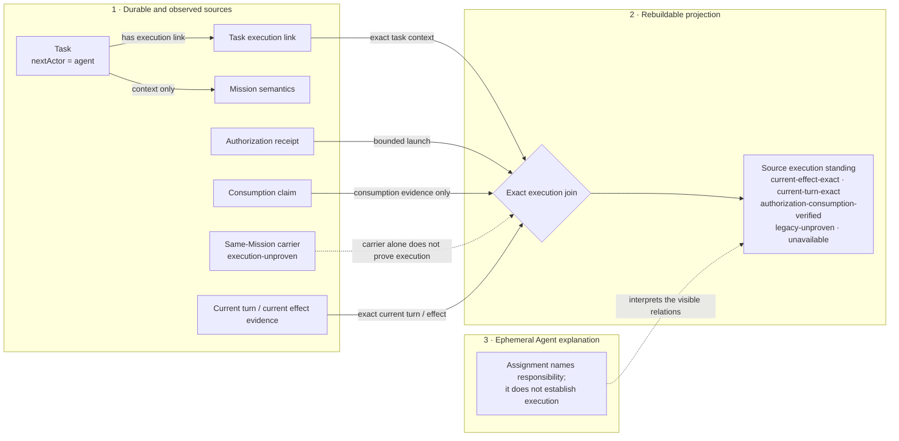

# Human-Agent Visualization

**Status:** revisable design candidate

**Implemented slices:** Execution Boundary Lens over a frozen Workbench snapshot,
a frozen Skill Lens over one `skill-engineering rewrite` request, and a local
Project Lens that converts one Agent-selected repository question and source set
into a revision-bound disposable evidence bundle.

## Product boundary

Human-Agent Visualization is a communication medium through which a person can
perceive, question, and correct an Agent's understanding of information, code,
projects, and architecture. It should make relations, evidence, uncertainty,
and change easier to understand than a chat transcript or document alone.

It is not a decorative activity dashboard, a canonical graph database, or a
Workbench-only UI. A visually persuasive relation has no more authority than
the source and derivation behind it. The visualization product may cooperate
with a personal task application through explicit projections, but neither
product is a required dependency of the other and this medium does not own the
task application's facts.

Rossovia's program already names the governing test: visual states should
project real operational relations, while task lists, timelines, project views,
conversation, and other views remain alternate projections rather than backend
domain models ([Workbench is a perceptual surface](../../design/AUTONOMOUS-COLLECTIVE-INTELLIGENCE.md#workbench-is-a-perceptual-surface)).

## Common invariant: three visible layers

Every lens must preserve three layers even when their visual treatment changes.

| Layer | Contains | Authority and behavior |
|---|---|---|
| Durable and observed sources | Retained task and Mission records, source documents, revision identity, receipts, claims, and observed runtime state | Each item keeps its own authority, revision, freshness, and standing. Observation is not silently promoted to durable fact. |
| Rebuildable projections | Selected objects and relations computed from sources for the present question | Disposable and reproducible. A projection may organize or omit source material but cannot become its truth owner. |
| Ephemeral Agent explanation | The Agent's current framing, inferred relation, rationale, uncertainty, or proposed comparison | Clearly marked as interpretation, removable without losing evidence, and never rendered as an admitted fact merely because it is useful or confident. |

This follows the existing cognition boundary: immutable sources and exact-input
artifacts retain lineage, while catalogs, graphs, and visualizations are
projections without fact authority
([Cognition](../../packages/cognition/README.md)). Deterministic structural
projections are useful precisely when they remain rebuildable and do not turn
projection drift into fact drift
([Agent Cognition and Memory Engineering](../../design/research/agent-cognition-memory-engineering.md#deterministic-structural-projections)).

Every visible object and relation therefore exposes, on demand:

- its source or derivation layer;
- provenance through source references;
- revision identity when the source supplies one;
- freshness such as live, observed at build, cached with age, or unverified;
- its source-defined standing; any generic availability or validity label
  applies only to that individual relation, never as aggregate execution proof;
  and
- disconfirming evidence or the condition that would change the reading.

## First vertical slice: Execution Boundary Lens

The first lens answers one architecture question:

> Why does `nextActor=agent` not mean that an Agent is executing this task, and
> which source execution standing applies, and why?

This is a bounded, source-supported question. The Principal Workbench is
already a rebuildable projection over separately owned project, Git, task,
Mission, authorization, and runner sources. Its task assignment names
responsibility but does not prove Agent start
([Principal Workbench MVP](../../operations/workbench/README.md#principal-workbench-mvp)).
The snapshot explicitly describes source authority and freshness
([snapshot projection](../../operations/workbench/src/ui/projection.ts)), while
the work-item projection keeps lifecycle, next actor, binding, carrier,
execution standing, and evidence references separate
([work-item projection](../../operations/workbench/src/ui/work-items.ts)).

The slice consumes one frozen evidence bundle retained atomically by its fixture
builder. That bundle binds the exact serialized `WorkbenchSnapshot`, the exact
Principal-task observation and other inputs supplied to the work-item builder,
the derived `WorkItemSetProjection`, the builder revision, `generatedAt` and
source identities, the lens subject identity and task context, the
relation-contract version, deterministic digests for each retained artifact,
and a deterministic digest of the binding. These are semantic requirements,
not an accepted storage schema. The prototype rejects a separately supplied,
unbound, or mismatched snapshot/projection pair.

The bundle does not read or mutate the live control plane. Its snapshot remains
the lens's subject. A current/prior comparison appears only when both bundles
validate internally, name the same lens subject identity and task context, use
the same relation-contract version, and declare comparison-compatible builder
revisions. The first prototype requires the exact same builder revision. If any
condition fails, comparison is unavailable and hidden, and the UI names the
failed compatibility condition. A changed subject, task context, relation
contract, or builder algorithm must not be labeled source drift. The focused
objects are one Principal task, its optional project and Mission context, its
execution link, the relevant authorization receipt and consumption claim, one
current runner or effect observation, and the source execution standing.



The diagram is not a fixed topology. It renders the source execution standing
verbatim. `current-effect-exact` and `current-turn-exact` may establish current
execution at effect and turn granularity respectively.
`authorization-consumption-verified` proves only that launch authorization was
consumed. `legacy-unproven` and `unavailable` do not prove execution. A
same-Mission carrier remains `execution-unproven`. Missing, stale, ambiguous,
or mismatched individual relations remain visible; the lens must not fill them
with an Agent inference or reduce them to an aggregate satisfied/broken label.

## Interaction and attention path

The lens begins with the architecture question and one selected task, not with
an overview of every object in the system.

1. **Orient:** show the task, source execution standing, bundle identity, and
   whether its retained observations are cached, unverified, or incomplete.
2. **Locate the boundary:** focus on the one-hop relations needed to explain
   responsibility, authorization, execution, and verification. Highlight the
   first broken, unavailable, or mismatched individual relation; do not imply
   that it is itself an aggregate execution standing or that every upstream
   fact is equally urgent.
3. **Inspect evidence:** selecting a node or relation opens a source drawer with
   its source reference, authority, revision, freshness, standing, and available
   disconfirming evidence.
4. **Challenge the explanation:** layer toggles independently show or hide
   sources, projections, and Agent explanation. Source-only mode removes all
   derived and inferred relations.
5. **Perceive drift:** only two internally valid bundles with the same lens
   subject identity and task context, the same relation-contract version, and
   comparison-compatible builder revisions may show added, removed, changed,
   and unchanged relations. The first prototype requires the same builder
   revision. A changed source marks dependent projections for rebuild or
   review; it does not automatically declare their conclusions false. If a
   compatibility condition fails, comparison is unavailable and hidden, and
   the UI explains the failed condition rather than labeling an algorithm or
   subject change as source drift.

The view may pan or expand one hop around the selected relation, but it should
not reward browsing an unbounded graph. When evidence is absent, the recovery
signal is the named missing relation and its source boundary.

## Minimum relation-projection properties

The first prototype needs a semantic relation contract, not an accepted storage
schema. Each projected relation must be able to answer:

| Property | Question it answers |
|---|---|
| subject | What object is this relation about? |
| relation | What exact relation is being claimed or observed? |
| object | What does the relation point to? |
| derivation kind | Is it source-declared, deterministically derived, or Agent-inferred? |
| source references | Which evidence can reconstruct or challenge it? |
| revision identity | Against which source or snapshot version was it formed? |
| freshness | When and how was its current state observed? |
| standing | What exact standing does the owning source provide? If this is only relation availability or validity, how is that kept distinct from execution proof? |
| disconfirming evidence | What observation would weaken, invalidate, or require review of this relation? |

Names, serialization, indexes, storage, and transport remain prototype choices.
Different lenses may derive these properties from different sources and do not
need one shared canonical graph backend.

## Current source limits

The current Workbench sources are sufficient for this execution boundary, but
not for a general map of software architecture. They expose project and Mission
identity, observed Git context, local task context, authorization and
consumption evidence, runner state, work-item bindings, freshness, and source
references. They do not currently provide:

- a general source-linked component, ownership, call, or dependency relation;
- an accepted semantic architecture ontology;
- line- or symbol-level evidence for every `sourceRef`;
- a Workbench projection of cognition formation lineage; or
- proof that a frozen runner observation is still live.

The lens must say `unavailable` where those relations are absent. It must not
infer a whole architecture from filenames, proximity, Agent narration, or the
visual layout.

## Understanding lenses: introduce before exploring

An introduction to a complex Skill or open-source project is not a miniature
file browser and not an automatically summarized whole. It is a guided answer
to one human question, backed by relations the person can inspect and
challenge. Every understanding lens therefore combines two reading rhythms
over the same frozen evidence bundle:

- **Guided path:** a short, ordered account of the object's purpose, governing
  spine, one representative path, authority boundary, evidence, and remaining
  uncertainty. It spends attention on the relations needed for the selected
  question rather than on completeness.
- **Evidence exploration:** one-hop expansion, layer toggles, source-only mode,
  and the evidence drawer. It lets a person challenge the guided path without
  turning the interface into an unbounded graph.

The guided path is a projection, not a second explanation store. Its steps
select and order relations from the same bundle used by evidence exploration.
Agent-authored connective prose remains in the ephemeral layer. Removing that
layer must leave the source records and deterministic joins sufficient to
reconstruct what is known and what is unavailable.

Every understanding lens begins with this question-shaped contract:

| Field | Purpose |
|---|---|
| human question and audience | Decides what must become understandable now; an overview is not the default question. |
| subject and revision | Identifies the Skill, repository, release, commit, or working-tree overlay being described. |
| declared purpose and spine | Shows the object's own stated organization before Agent interpretation. |
| selected representative path | Follows one trigger, use, change, execution, or verification path end to end. |
| authority and non-scope | Makes ownership, routing, and human acceptance boundaries visible. |
| verification and uncertainty | Separates declared structure, observed behavior, retained evidence, inference, and unavailable relations. |

Different lenses may use different relation types and compositions. They share
this question contract, the three-layer invariant, the evidence properties,
and source-compatible comparison; they do not require one universal topology,
ontology, interaction layout, storage system, or canonical graph backend.

### Skill Lens

The representative question for a complex Skill is:

> Why is this Skill relevant to the request, what judgment does it own, which
> path will it take, what evidence can make the result ready, and where must it
> stop?

For `skill-engineering`, the guided path is:

```text
request and trigger compatibility
  → recurring action-gap evidence and minimum-form gate
  → method eligibility
  → owned agent-expression judgment
  → selected create / rewrite / review / test dispatch
  → directly required principle and reference context
  → action and artifact path
  → behavior evidence and readiness standing
  → authority stop
```

The static package can source-declare its trigger vocabulary, scope, P-ID
lineage, dispatch edges, direct-reference edges, work method, output gates, and
authority clauses. A deterministic projection may select and order those
relations. Trigger compatibility is only a vocabulary-level standing. Method
eligibility additionally requires evidence of a recurring, localized Agent
action gap and a judgment that a Skill rewrite is the smallest truthful form;
without those bound inputs it remains `eligibility-unproven`. Neither standing
proves that the runtime activated the Skill, loaded a referenced file, followed
a declared principle, or improved behavior. Those claims require runtime or
evaluation evidence; otherwise they render as Agent inference or
`unavailable`.

The most dangerous Skill visualization is a green pipeline from declared P-IDs
through prompt files to “better Agent behavior.” Declared lineage is not causal
proof, dispatch is not observed loading, and structural completeness is not a
behavior result. In particular, when no retained expression-team record links
a Supporting P-ID to a concrete decision delta, that edge remains inferred.

The first Skill Lens fixture should bind one concrete request, the observed
recurring action-gap evidence, the minimum-form decision, the exact target
Skill revision and complete target surface required by the selected operation,
the owning Skill's `SKILL.md`, only the selected command and direct references,
the declared principle sources, and any retained probe evidence. The first
screen separately renders `trigger-compatible`, method eligibility,
`activation-observed` or `activation-unavailable`, and behavior-evidence
standing. It shows one selected path plus an authority-stop card; it does not
render the whole package tree.

At the standing strip's actual display size, every cue names its own derivation
layer and fallback. Trigger and method cues are deterministic projections;
runtime and behavior cues report limits in the frozen sources. Missing evidence
stays unavailable or unproven instead of being filled by a declaration, a
structurally complete package, color, motion, or Agent explanation. These labels
are a disposable presentation adapter over the existing projection, not a new
standing source.

### Project Lens

The representative newcomer question for an open-source project is:

> What is this project for, where should I start for my intent, how does one
> real path cross its major responsibilities, and which statements can I
> trust?

The lens first asks for an arrival intent such as **use**, **understand**, or
**change**. It then follows one project-declared path rather than drawing every
directory. For this repository and the intent “change one Skill,” the path is:

```text
project purpose
  → Principle Sequence semantic root
  → selected interpretation
  → Skill expression and progressive context
  → package / behavior verification
  → human acceptance
```

Declared purpose, semantic roots, responsibility boundaries, public commands,
and accepted architecture remain source-layer facts. A source scanner may
deterministically project observed files, manifests, symbols, imports, tests,
and revisions when it can retain exact evidence. The statement that one part
is the best starting point, that several files form an architectural component,
or that a change will affect another responsibility remains Agent explanation
unless an owning source or verified relation establishes it.

The most dangerous Project visualization is a radial directory or dependency
graph that gives every path equal architectural weight and infers authority
from containment, naming, import proximity, or visual centrality. The lens must
distinguish declared architecture from observed structure and both from Agent
interpretation. When a project has no accepted component, call, ownership, or
change-impact relation, the corresponding architecture claim is
`unavailable`—not completed from the file tree.

The implemented MVP exposes an Agent-callable `introduce` command. It observes
one local repository revision and selected source paths, retains excerpts and
full-content revisions, derives only file/manifest/verification relations it can
rebuild, and renders a guided path plus evidence drawer. Before a bundle reaches
the browser, the CLI URL binds the generated bundle identity and the local
server re-reads the repo and reconstructs its subject, sources, and projection;
internal self-consistency digests alone are insufficient. Focus
paths must also remain within the repo after realpath resolution. `--focus` is an
Agent-selected reading path and therefore remains explanation-layer ordering;
the retained sources do not acquire architectural authority from that order.
Generated bundles live under ignored `generated/` state and can be rebuilt from
the repository; they do not become project memory or a second architecture
source.

The current Project Lens keeps this current-state introduction as its default
mode. An adjacent change-impact mode accepts an explicit base revision plus one
or more Agent-selected responsibility scopes. Each scope must name an exact
design heading, explicit implementation paths, and optional verification files.
The builder locates the current and base design sections, observes Git changes
only inside those explicit scopes, and projects `changed`, `disputed`,
`unchanged`, or `unavailable`. The selection is an Agent inspection scope rather
than accepted architecture; missing headings stay unavailable, and reconciliation
never accepts a design or behavior claim. The browser highlights only changed or
disputed responsibilities by default and exposes path, line range, and revision
on expansion. At 390px, both modes use one reading column and the change-impact
mode orders comparison identity before responsibility and unresolved state.

### Later Code and Information lenses

Code and Information lenses remain possible only after representative human
questions expose reliable relations worth projecting. A Code Lens may follow
one request, state transition, call path, or change-impact question; an
Information Lens may follow provenance, contradiction, synthesis, or decision
support. They inherit the question-shaped contract and evidence boundary, but
neither is admitted merely because an AST, embedding, search result, or graph
can be generated.

## Acceptance experiment

Use the same representative Workbench case and architecture question for a
Principal comprehension comparison between the existing docs/chat materials
and the Execution Boundary Lens, varying order when the comparison design
permits it. Observe whether the Principal can:

- distinguish assigned responsibility from authorized and observed execution;
- read `current-effect-exact`, `current-turn-exact`,
  `authorization-consumption-verified`, `legacy-unproven`, and `unavailable`
  with their actual evidence boundaries;
- identify the exact unavailable, broken, or mismatched individual relation
  without treating that label as aggregate execution proof;
- trace a conclusion to its owning source and notice stale or cached evidence;
- understand why comparison is unavailable when bundle subject, task context,
  relation-contract version, or builder revision is incompatible, without
  interpreting that incompatibility as source drift;
- separate an Agent explanation from a source-backed projection; and
- state the remaining uncertainty without learning internal protocol names.

The lens is supported only if it improves that concrete understanding without
creating new authority mistakes. A falsifying observation is that the Principal
concludes execution from `nextActor=agent`,
`authorization-consumption-verified`, a same-Mission carrier, or the Agent's
explanatory overlay after using the lens. In particular,
`same-mission-current-carrier` remains visibly `execution-unproven` and cannot
be visually upgraded by proximity to exact evidence for another relation.

## Implemented next prototype

The implemented Execution Boundary Lens remains evidence for the shared
three-layer and inspection mechanics. The next vertical slice is a read-only
Skill Lens for one fixture-authored `skill-engineering rewrite` request. It binds
the complete target Skill surface, exact owning-Skill revision, selected dispatch
and direct references, principle source identities, extracted source relations,
and projection revision in one validated fixture. The retained project decision
supports `skill-engineering`'s general owner and gate, not eligibility for this
specific request. Because no concrete recurring-failure record or minimum-form
decision is retained, those steps are explicit fixture hypotheses and the method
standing remains `eligibility-unproven`; runtime activation and behavior evidence
also remain unavailable.

It renders the guided path, layer toggles, evidence drawer with retained excerpts,
source-only mode, explicit unavailable relations, and the authority-stop card.
One-hop graph expansion is intentionally omitted because the ordered path and
fixture-local inspection close the current introduction question without a graph.
Compare it with reading the relevant `SKILL.md` and chat explanation.
Before testing, freeze a comparable document/chat packet from the same source
revision and a meaningful improvement criterion. Use the same questions and
representative reader class for both conditions, vary order when possible, and
record correctness, boundary misclassifications, time to a supported answer,
source reopenings, and confidence. The slice is useful only if a human can
correctly identify:

- trigger compatibility, method eligibility, and observed runtime activation
  as three different standings;
- the Skill's owned judgment and the boundary that routes elsewhere;
- the selected dispatch and progressively loaded context without assuming all
  package files were consumed;
- declared principle lineage without treating it as causal proof; and
- the behavior evidence still required before readiness or improvement can be
  claimed.

The Lens must reduce at least one predeclared misunderstanding or materially
reduce the effort needed to reach the same supported answer without introducing
a new authority mistake. If the document/chat baseline already answers every
question correctly with comparable effort, the experiment has no headroom and
cannot attribute an improvement to the Lens. Correct answers in the Lens
condition alone establish comprehension, not comparative value.

After this comprehension result, the Project Lens may compose the same kernel
across several responsibility owners for one newcomer intent. Do not add live
repository indexing, a universal ontology, graph storage, editing actions, or
automatic architecture claims merely to make that later map broader.
